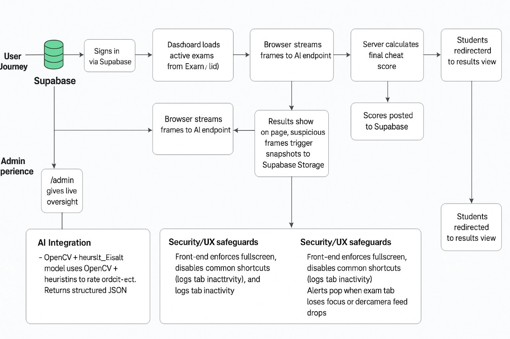
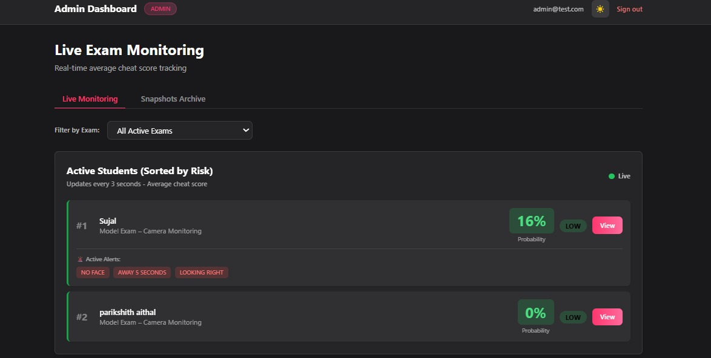
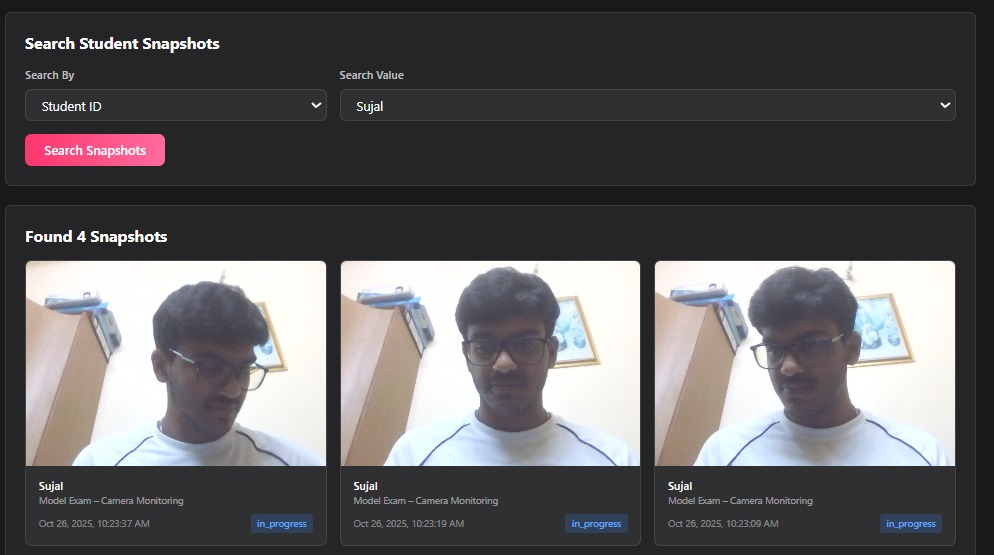

# AI-VERSE

An AI-powered examination proctoring system that provides real-time monitoring and suspicious activity detection.

## System Flow


The system follows a comprehensive flow:
1. Users sign in through Supabase authentication
2. Dashboard loads active exams for users
3. Browser streams frames to AI endpoint for analysis
4. Server calculates final cheat score
5. Students can view their results
6. Admin portal provides live oversight
7. Security measures include:
   - OpenCV + heuristic models for detection
   - Front-end security safeguards
   - Tab inactivity monitoring
   - Full-screen enforcement

## Features

- 🔐 **Secure Authentication**
  - User registration and login
  - Role-based access control (Admin/Student)
  - Supabase authentication integration

- 📹 **Real-time Proctoring**
  - Live video monitoring
  - Automated suspicious activity detection
  - Face detection and tracking
  - Multiple face detection alerts
  - Real-time snapshot capture

- 🎯 **Admin Dashboard**

  - Live student monitoring
  - Real-time video feeds
  - Suspicious activity notifications
  - Session management
  - Performance analytics

- 📊 **Snapshot Analysis**

  - AI-powered behavior analysis
  - Suspicious activity timeline
  - Video recording review
  - Detailed incident reports
  - Snapshot history

## Tech Stack

- **Frontend**
  - Next.js 13+ with App Router
  - TypeScript
  - Tailwind CSS
  - Real-time WebSocket connections

- **Backend**
  - Supabase (PostgreSQL)
  - Python ML Services
  - Real-time Database
  - Secure File Storage

- **AI/ML**
  - Computer Vision for face detection
  - Behavior analysis algorithms
  - Real-time ML inference

## API Endpoints

- `/api/exam/start` - Initialize exam session
- `/api/exam/submit` - Submit exam responses
- `/api/exam/analyze` - Process exam session
- `/api/exam/upload-video` - Handle video uploads
- `/api/admin/snapshots` - Manage suspicious snapshots

## Project Structure

```
AI-VERSE/
├── app/                    # Next.js 13 app directory
│   ├── admin/             # Admin dashboard
│   ├── exam/              # Exam interface
│   ├── auth/              # Authentication
│   └── api/               # API routes
├── components/            # React components
├── lib/                   # Utilities and types
└── model_prediction/      # Python ML services
```

## Getting Started

1. Clone the repository
```bash
git clone https://github.com/yourusername/ai-verse.git
```

2. Install dependencies
```bash
npm install
cd model_prediction && pip install -r requirements.txt
```

3. Set up environment variables
```bash
cp .env.example .env.local
```

4. Run the development server
```bash
npm run dev
```

5. Start the ML service
```bash
cd model_prediction && python api.py
```

## Screenshots

### Admin Dashboard - Live Monitoring

- Real-time student video feeds
- Suspicious activity alerts
- Session controls
- Performance metrics

### Suspicious Activity Detection

- AI-powered snapshot analysis
- Timeline view of incidents
- Detailed behavior reports
- Quick action tools

## License

MIT License - See LICENSE file for details

## Contributing

1. Fork the repository
2. Create a feature branch
3. Commit your changes
4. Push to the branch
5. Open a Pull Request